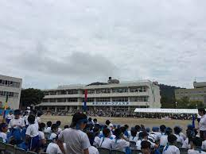
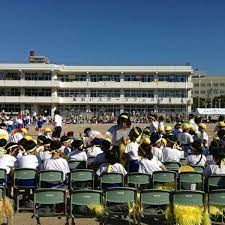
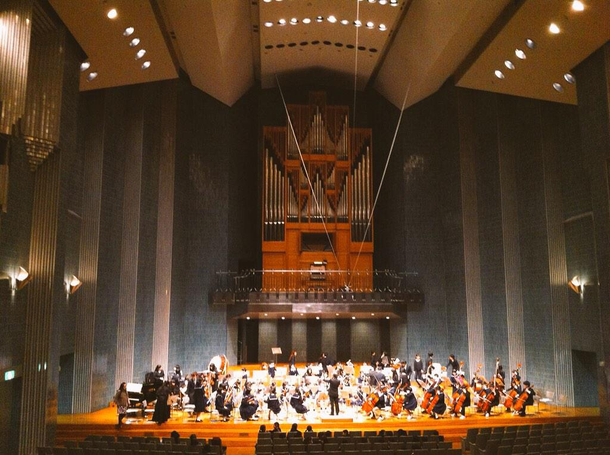
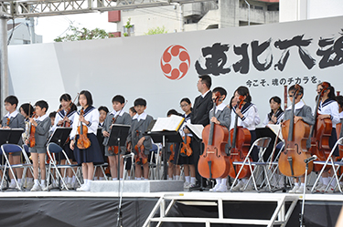
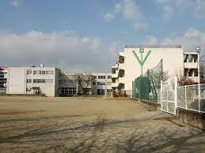
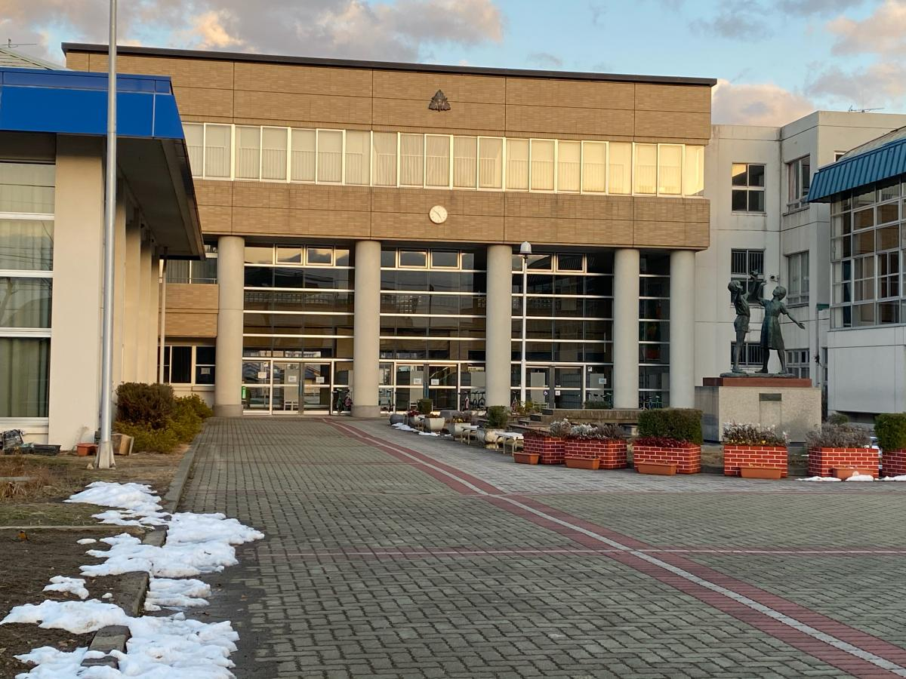

<!DOCTYPE html>
<html lang="ja">

    <head>
      <meta charset="UTF-8">
    <title>福島大学附属小学校の紹介</title>
    <header>
    <h1>福島大学附属小学校の紹介</h1>
    
今は大分に住んでいますが、私は福島県で産まれました。大分からはだいぶ遠いところですが、私の出身小学校の特徴や行事などを紹介したいと思います。

</header>
</head>

<body>

<h2>
  <u>あおいスポーツフェスタ</u>
</h2>
 
運動会は『あおいスポーツフェスタ』という名称で、各クラス4チームに分かれます。緑、黄色、青、赤とハチマキで色分けされ、各競技で得たポイントの合計で勝負します。玉入れ、綱引き、騎馬戦などいろいろな競技があります。
 

<h2>
  <u>地区あおい家族</u>
</h2>

  『地区あおい家族』という時間があります。これは、生徒の住む地域ごとに生徒全員を学年に関係なく班に分けて、上級生も下級生も交流をすることができる時間です。特別授業などでは班ごとに地域の施設などで活動することもあります。ちなみに学区はバスや電車などの公共交通機関を使い1時間以内程度と決まっているそうです。

<h2>
  <u>部活動について</u>
</h2>

  附属小学校には、部活動もあります。陸上部・合奏部（管弦楽）・合唱部の３つです。また、水曜日の6校時目に、夏と秋にクラブ活動もあります。野球やサッカーなどの屋外活動、パソコンや茶道などの屋内活動です。私はパソコンクラブに所属しており、パソコンが得意だったのでクラブのみんなにパソコンの使い方などを教えていました。当時見ていた面白いサイトなどをみんなに見せて笑わせていたのが懐かしいです。

<h2>
  <u>合奏部について</u>
</h2>

私は合奏部に所属していました。私の小学校は毎年全国大会に出場するほどの強豪校で、楽器はパーカッション(打楽器)をやっていました。６年生のときに、千葉県に泊りがけで全国大会に行きました。結果は僅差で２位でした。ここでは語りきれないほどの楽しい思い出がたくさんあるので、入部してよかったなと思いました。大分ではジュニアオーケストラが毎年８月、３月あたりに演奏するのを見に行っています。

この写真の外ですが左側に私がいます。

<h3>
Webサイト
</h3>

福島大学附属小学校のホームページです。

<a href="http://www.aes.fukushima-u.ac.jp/index.htm"</a>

<footer>
  
&copy; 2022 村上 了雅

</footer>
</body>
</html>
